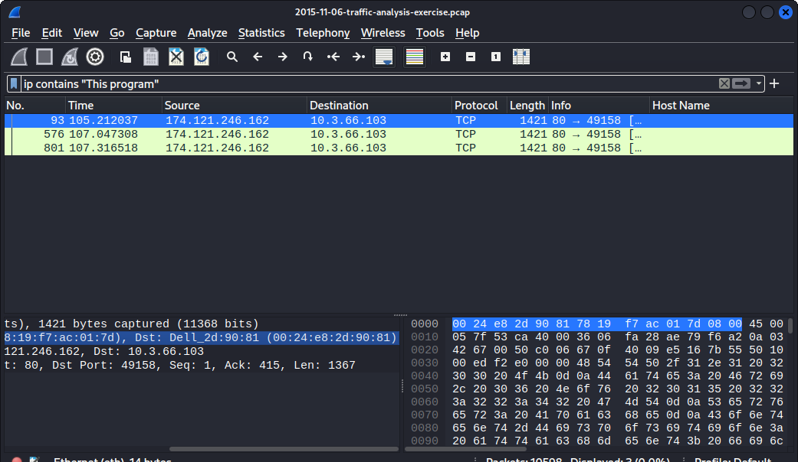

# **Live Project**
## **Introduction**
During our 2 week sprint at The Tech Academy, myself and the Cyber Security team worked together to complete both **Offensive** and **Defensive stories** under the *Scrum* methodology.  All testing and anlayzation was conducted within the Kali Linux version 2022.4 virtual machine and the VirtualBox software.  The Wireshark and Burp Suite tools were used for most tasks, along with pcap files, and the creation of the vulnerable application via the Kali Linux Terminal command line. We were able to perform the actions of a SOC Anlayst and a penetration tester, with the gradual level of complexity increasing after each completed task. Fortunately, the team *Scrum Master* was on the ground with us for assistance in executing an objective.  The following are snippets of analyzation and pen testing practices that I worked on, with links for each story to quickly navigate to.
## Defensive Stories
* [Malware Traffic](#malware-traffic)
* [Malware Analysis](#malware-analysis)
* [Malicious Email](#malicious-email)
### Malware Traffic
A pcap file and Wireshark was used for this exercise.  This story displays using the **ip contains "This program"** filter to reveal the source and destination IP address that the executable file traveled to infect the victims computer after download.

### Malware Analysis
The objective for this task was to find out how 3 different types of malware infected the victim's computer.  I used the filter below to identify the victim's Hostname and Window's user account name.

Here I used the TCP Stream to display the Host URL in the GET request that one of the malware's came from.

### Malicious Email 
In this task, one of my objectives was to figure out what the victim's mac address was that the infected Trojan Horse malware via fax document in an email was sent to.  I was able to verify the full address and that it was a Dell computer.

## Offensive Stories
* [Admin Login](#admin-login)
* [User Login](#user-login)
* [CAPTCHA Exploit](#captcha-exploit)
* [Reset Admin Password](#reset-admin-password)
* [Access Secure Documents](#access-secure-documents)
* [Download Secure Document](#download-secure-document)
### Admin Login
This penetratrion test consisted of using Burp Suite and the OWASP Juice-Shop application.  My task was to log into the administrator's user account without using a password.  Once the SQL error revealed itself under the Network tab after inspecting the page, I was able to apply the **always true** SQL injection to gain access.

### User Login
This task was to see if user accounts within the application are able to be easily accessed by injections at the login page.  The Burp Suite software and an SQL injection into the email field was used to identify the auth token within the HTTP response under the Repeater tab.

### CAPTCHA Exploit
In this story, my task was to bypass the CAPTCHA bot check to gain access to the account.  I used Burp Suite to implement a Denial of Service(DoS) attack by generating 15 payloads.

As a result, this verifies a successful attack and the vulnerability by the POST request within the HTTP history tab.

### Reset Admin Password
This penetration test was to see if the application was vulnerable to the resetting of an administrator's password.  This was accomplished via a brute force attack with 1,050 of the most common passwords used.  Below is me using Burp Suite's **grep extract** feature to define the response, so a successful attack stands out.  

This is a display of gaining the auth token and discovering the current admin password in order to change to a new one.

### Access Secure Documents
The tools used for this story was the inspect feature within the browser and the OWASP application.  My task was to gain access to an important secure document.  The HTTP request header revealed the directory where the document was located while using the inspect feature.  I then navigated to that directory where the acquisitions file was found.

### Download Secure Document
The below pen testing task was to attempt to gain access to and download a secure document to obtain the contents within it.  You will see that this application has a null byte attack vulnerability through manipulation of the GET request and Burp Suite's Repeater feature leading to a successful response.
.png)